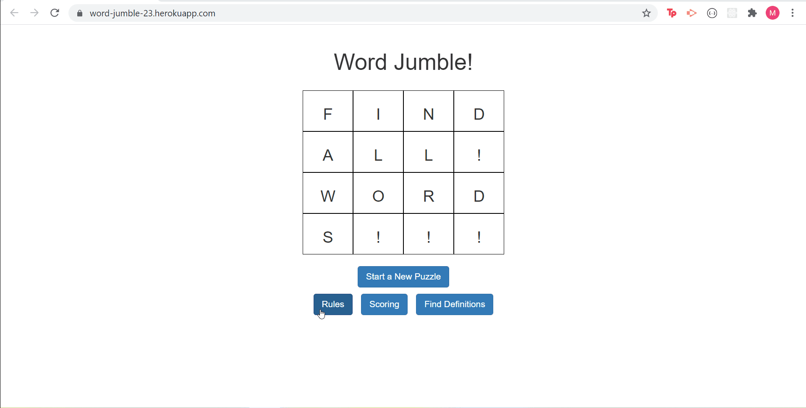

# Word Jumble!
###### Description
This app let's you compete against your friends in a race to write down the most words before time runs out!

[Click here to live link](https://word-jumble-23.herokuapp.com/)

## Contributors
* mwturner611

## Technology
Heroku, JQuery, AJAX, API, HTML and SASS 

## Table of Contents
* [Top of Page](#description)
* [Technologies Used](#technologies)
* [Usage](#usage)
* [License](#license)
* [Contributing](#contributing)
* [Contacts](#contacts)

## Demo

## Usage 
1. You can view the rules of the game by clicking "Rules".
2. When you're ready click the "Start a New Puizzle" button and begin!
3. Once the time has run out, see how you did by opening the "Scoring" section.
4. If there's a dispute over a word, ensure that it is a real word by clicking "Find Definitions" and pulling up a definition for the word.  
5. Play again!

## License
This project is licensed under The MIT License (MIT).

## Contributing Guidelines
All contributions and suggestions are welcome! For direct contributions, please fork the repository and file a pull request.

## Contacts
* Name: Matt Turner (@mwturner611)
* e-mail: mwturner611@gmail.com
* LinkedIn: https://www.linkedin.com/in/matt-turner-ba328211a/*# 